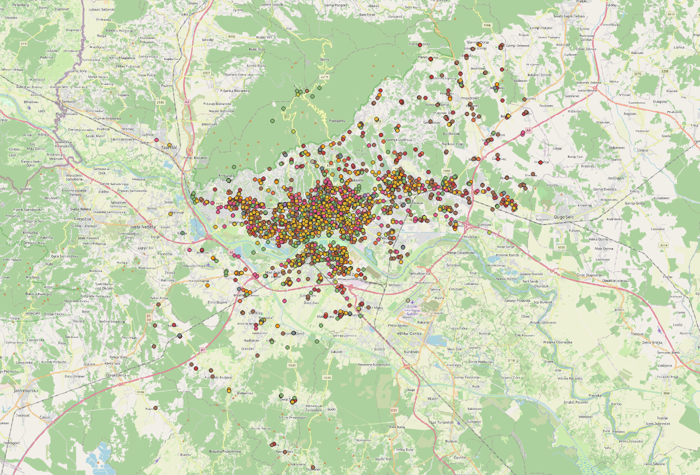

# osm-zipp-2020

## Hrvatski

Uvod
-------------------
Ovaj set podataka sadrži vektorske  podatke Geoportala zagrebačke infrastrukture prostornih podataka - ZIPP.

Licenca
-------------------
Licenca dopušta korištenje podataka za potrebe OpenStreetMap projekta.

Svi dostavljeni podaci mogu se koristiti isključivo za potrebe OpenStreetMap projekta, a za ostale primjene potrebno ja zatražiti pismenu suglasnost [Gradskog ureda za strategijsko planiranje i razvoj grada](https://geoportal.zagreb.hr/).

Prilikom javne objave materijala obvezno je naznačiti izvor - [Grad Zagreb, Gradski ured za strategijsko planiranje i razvoj Grada](https://geoportal.zagreb.hr/).

## FAQ
#### Što podaci sadrže:
Vektorske podatke sa geoportala Gradskog ureda za strategijsko planiranje i razvoj Grada 

#### Što je GeoJson format?
GeoJSON je format za kodiranje raznih geografskih podatkovnih struktura.
Za intenzivniju dokumentaciju i uputstva proučite [GeoJson Blog](http://geojson.org/)

#### Starost podataka
Podatke održava [Grad Zagreb, Gradski ured za strategijsko planiranje i razvoj Grada](https://geoportal.zagreb.hr/) i podaci su iz 2020.

#### Koja je kvaliteta podataka?
Podaci su dostavljeni kakvi jesu, mogu sadržavati greške te budite pažljivi pri korištenju podataka. Gradski ured za strategijsko planiranje i razvoj Grada može provjeriti i prihvatiti sve greške koje uočimo u njihovim podacima.

#### Koji je koordinatni sustav?
EPSG: 4326

#### Hoće li biti još podataka?
Moguća je ažurirana verzija ovih setova podataka.

#### Zašto su podatci objavljeni?
Hrvoje Bogner tražio je [Grad Zagreb, Gradski ured za strategijsko planiranje i razvoj Grada](https://geoportal.zagreb.hr/) pravo korištenja podataka za potrebe OpenStreetMap projekta.

#### Trebamo li importati podatke u OpenStreetMap?
Možda, ali ne automatski, koristite ove podatke za provjeru kvalitete OpenStreetMap podataka te integraciju oba seta podataka radi bolje prostorne i informacijske komponente elemenata. Nikadn nemojte pregaziti postojeće podatke koje su prijašnji korisnici mukotrpno skupljali, rađe provjerite njihovu kvalitetu i nadopunite ih. Provjerite kvaliteru lokalnih podataka i raspravite bilo kakav import sa [lokalnom zajednicom](https://lists.openstreetmap.org/listinfo/talk-hr). Uvijek sljedite [OSM pravila za importe](https://wiki.openstreetmap.org/wiki/Import/Guidelines).

### Podatci sa ZIPP Geoportala

| Gradska uprava | Broj elemenata |
| ------------- |:-------------:|
| druge_javne_ustanove | 6 |
| gradsko_tijelo | 100 |
| gradsko_trgovacko_drustvo | 34 |
| mjesna_samouprava | 218 |
| podrucni_ured | 11 |
| sjediste_gradske_cetvrti | 17 |

| Kultura | Broj elemenata |
| ------------- |:-------------:|
| centar_za_kulturu_i_narodno_sveuciliste | 19 |
| galerija | 63 |
| kazaliste | 17 |
| kinematograf | 14 |
| knjiznica | 44 |
| koncertna_dvorana | 4 |
| muzeji_i_zbirke | 43 |

| Obrazovanje | Broj elemenata |
| ------------- |:-------------:|
| djecji_vrtic | 331 |
| obrazovanje_odraslih | 2 |
| osnovne_skole | 177 |
| srednje_skole | 95 |
| studentski_restoran | 19 |
| studentsko_naselje | 4 |
| ucenicki_dom | 15 |
| visokoskolska_ustanova | 75 |

| Ostalo | Broj elemenata |
| ------------- |:-------------:|
|crkva_rimokatolicka_zupa | 91 |
|nacionalna_manjina | 20 |
|policija | 12 |
|porezna_uprava | 12 |
|tdu | 39 |
|vatrogasci | 63 |
|vjerske_zajednice | 42 |

| Promet | Broj elemenata |
| ------------- |:-------------:|
| benzinske_postaje | 107 |
| elektricne_punionice | 40 |

| Socijalna zaštita | Broj elemenata |
| ------------- |:-------------:|
| centar_za_socijalnu_skrb | 17 |
| dom_za_djecu | 9 |
| dom_za_starije | 99 |
| nadlezna_institucija | 8 |
| ostale_ustanove | 9 |
| podrucje_nadleznosti_czss | 11 |
| ustanova_za_beskucnike | 6 |
| ustanova_za_branitelje | 4 |
| ustanova_za_osobe_s_invaliditetom | 49 |

| Sport i rekreacija | Broj elemenata |
| ------------- |:-------------:|
| sportska_igralista | 170 |
| sportski_objekti | 211 |

| Zdravstvo | Broj elemenata |
| ------------- |:-------------:|
| dom_zdravlja | 133 |
| dom_zdravlja_hitna | 9 |
| hzzo | 9 |
| ljekarna_dezurna | 5 |
| ljekarne | 245 |
| zdravstvene_ustanove | 47 |

## English

Introduction
-------------------
This dataset contains vector data from Geoportal of Zagreb infrastructure of spatial data - ZIPP. 

License
-------------------
This data is licensed for use in OpenStreetMap project.

All delivered data can be used exclusively for the purposes of the OpenStreetMap project, for other applications you need to acquire the written consent of the [City of Zagreb, City Office for the Strategic Planning and Development of the City](https://geoportal.zagreb.hr/).

When publishing the material, it is obligatory to attribute the source - [City of Zagreb, City Office for the Strategic Planning and Development of the City](https://geoportal.zagreb.hr/).

## FAQ
#### What the data include:
Vector data from [City of Zagreb, City Office for the Strategic Planning and Development of the City](https://geoportal.zagreb.hr/) Geoportal 

#### What is the GeoJson format?
GeoJSON is a format for encoding a variety of geographic data structures. 
For Intensive Documentation and Tutorials, Refer to [GeoJson Blog](http://geojson.org/)

#### Data Vintage
Geoportal vector data is maintained by [City of Zagreb, City Office for the Strategic Planning and Development of the City](https://geoportal.zagreb.hr/) and the data is from 2020.

#### How good are the data?
Data is provided as is, there may be errors so be careful using the data. City of Zagreb may review and accept all errors we find in their data.

#### What is the coordinate reference system?
EPSG: 4326

#### Will there be more data coming?
Possible update of these data sets.

#### Why is the data being released?
Hrvoje Bogner asked [City of Zagreb, City Office for the Strategic Planning and Development of the City](https://geoportal.zagreb.hr/) for the rights to use their data for OpenStreetMap project.

#### Should we import the data into OpenStreetMap?
Maybe, but not automaticaly, use this data to inspect OpenStretMap data qaulity and integrate both data to get better position and information on each element. Never overwrite the hard work of other contributors or blindly import data into OSM without first checking the local quality and fix the data. Inspect quality locally and discuss any import plan with the [local community](https://lists.openstreetmap.org/listinfo/talk-hr). Always follow the [OSM import community guidelines](https://wiki.openstreetmap.org/wiki/Import/Guidelines).
